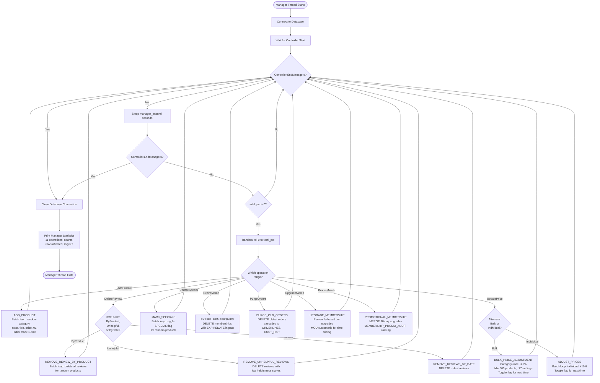

Welcome to the **DVD Store 3.6** *dyeisley fork* - This is currently a development version and has been made public to allow for
collaboration and forward progress without impacting the previous version 3.5.  

*All testing has been done on Linux only.* 

The web driver (drivers/ds36webfns.cs) and PHP code have not been modified.  

## What's New in 3.6

- **Multi-Database Orchestrator**: New orchestrator executable for side-by-side performance comparison - launches MySQL, SQL Server, PostgreSQL, and Oracle simultaneously with identical workload parameters, real-time labeled output, and automated comparison tables showing OPM, response times, analytics, and manager operations across all databases
- **Manager Thread System**: Background thread with 11 administrative operations (AddProduct, RemoveReviews, AdjustPrices, BulkPriceAdjustment, MarkSpecials, ExpireMemberships, PurgeOldOrders, UpgradeMembership, PromotionalMembership)
- **Analytics System**: Separate analytics thread tracks membership tiers, new customer acquisition, and review activity with delta tracking and configurable intervals
- **Membership Renewal**: Members can renew expired memberships (controlled by pct_renewmember parameter); non-members cannot browse by membership; BROWSE_BY_MEMBERSHIP uses customer's actual membership tier
- **MERGE/UPSERT Support**: NEW_REVIEW_HELPFULNESS and PromotionalMembership use MERGE/UPSERT with audit tracking - prevents duplicate ratings, handles race conditions, provides batch promotional upgrades, and adds database feature coverage (MERGE operations and trigger behavior testing)
- **Data Generation Improvements**: Linear database scaling (200:10:1 ratio from 4 GB baseline), dynamic popular products modulo for small databases
- **C# Code Modernization**: Cross-platform compatibility (Stopwatch), resource management (using statements), command pre-compilation, 20%+ code reduction
- **Parameter Parsing Rewrite**: Dictionary-based lookup, type-safe validators, centralized configuration
- **Code Formatting**: Applied dotnet format linter for consistent styling across all projects
- **Index and Trigger Consistency**: Standardized indexes and triggers across all 4 database platforms
- **Validation SQL Framework**: Before/after validation scripts for verifying manager operations and data integrity
- **LOGIN Performance Fix**: Added ORDER BY + LIMIT to return only 10 most recent orders (35% improvement on SQL Server)

See [CHANGES.md](CHANGES.md) for detailed changelog.

## Customer Workflow

The diagram below shows the complete customer operation flow, from login/registration through purchase:

```mermaid
graph TD
    Start([Customer Thread Starts]) --> NewCustomerRoll{Random Roll<br/>< pct_newcustomers?}

    NewCustomerRoll -->|Yes| NewCustomer[NEWCUSTOMER<br/>Allocate ID atomically<br/>username = user + new_id<br/>membershiplevel_out = 0]
    NewCustomerRoll -->|No| Login[LOGIN<br/>GetSkewedCustomerId<br/>Favors recent customers]

    Login --> CheckMembership[Get Membership Status]

    CheckMembership --> IsExpired{Membership<br/>Expired?}

    IsExpired -->|Yes| RenewRoll{Random Roll<br/>< pct_renewmember?}
    RenewRoll -->|Yes| RenewMember[RENEW_MEMBERSHIP<br/>Extend +1 year]
    RenewRoll -->|No| SetMemberLevel0[membershiplevel = 0]
    RenewMember --> NewMemberCheck
    SetMemberLevel0 --> NewMemberCheck

    IsExpired -->|No/None| NewMemberCheck
    NewCustomer --> NewMemberCheck

    NewMemberCheck{membershiplevel = 0 AND<br/>not expired AND<br/>roll < pct_newmember?}
    NewMemberCheck -->|Yes| NewMember[NEW_MEMBER<br/>60% Bronze, 30% Silver, 10% Gold<br/>Any non-member can join]
    NewMemberCheck -->|No| BrowseProducts
    NewMember --> BrowseProducts

    BrowseProducts{Is Member?<br/>tier > 0}
    BrowseProducts -->|Yes| BrowseByTier[BROWSE_BY_MEMBERSHIP<br/>using customer's tier<br/>Bronze→1, Silver→2, Gold→3]
    BrowseProducts -->|No| SelectBrowseType[Random Select:<br/>category, actor, title<br/>or vector if enabled]

    SelectBrowseType --> NonMemberBrowse{Browse Type?}
    NonMemberBrowse -->|category| BrowseCategory[BROWSE_BY_CATEGORY]
    NonMemberBrowse -->|actor| BrowseActor[BROWSE_BY_ACTOR]
    NonMemberBrowse -->|title| BrowseTitle[BROWSE_BY_TITLE]
    NonMemberBrowse -->|vector| BrowseVector[BROWSE_BY_VECTOR]

    BrowseByTier --> StoreBrowseResults[Store prod_id_out array]
    BrowseCategory --> StoreBrowseResults
    BrowseActor --> StoreBrowseResults
    BrowseTitle --> StoreBrowseResults
    BrowseVector --> StoreBrowseResults

    StoreBrowseResults --> BrowseReviewsPhase[BROWSE_REVIEWS Phase<br/>n_reviews iterations]
    BrowseReviewsPhase --> GetReviewsPhase[GET_REVIEWS Phase<br/>n_reviews iterations<br/>by stars/date/noorder]

    GetReviewsPhase --> NewReviewRoll{Random Roll<br/>< pct_newreviews?}
    NewReviewRoll -->|Yes| NewReview[NEW_REVIEW<br/>Write review for product]
    NewReviewRoll -->|No| HelpfulnessRoll
    NewReview --> HelpfulnessRoll

    HelpfulnessRoll{Random Roll<br/>< pct_newhelpfulness?}
    HelpfulnessRoll -->|Yes| NewHelpfulness[NEW_REVIEW_HELPFULNESS<br/>MERGE/UPSERT rating]
    HelpfulnessRoll -->|No| BuildCart
    NewHelpfulness --> BuildCart

    BuildCart[Build Shopping Cart<br/>1 to 2*n_line_items + tier] --> FillCart{Member with<br/>Browse Results?}
    FillCart -->|Yes| UseBrowseResults[Fill from prod_id_out array<br/>tier-specific products]
    FillCart -->|No| UseRandom[GetSkewedProductId<br/>random products]

    UseBrowseResults --> Spillover{Cart > Browse<br/>Results?}
    Spillover -->|Yes| UseRandom
    Spillover -->|No| Purchase
    UseRandom --> Purchase

    Purchase[PURCHASE<br/>Create Order + Orderlines<br/>LAST OPERATION] --> End([End Customer Operation])
```

*Note: If viewing this README outside of GitHub, see [docs/customer_workflow.png](docs/customer_workflow.png) for a static image.*

## Analytics Workflow

The analytics thread captures baseline metrics before the test starts, then periodically runs analytics queries to track changes:

```mermaid
graph TD
    Start([Analytics Thread Starts]) --> Connect[Connect to Database]
    Connect --> CheckInterval{analytics_interval<br/>> 0?}

    CheckInterval -->|No| WaitStart[Wait for Controller.Start]
    CheckInterval -->|Yes| CaptureBaselines[Capture Baselines<br/>Before test starts]

    CaptureBaselines --> MembershipBaseline{enable_membership<br/>_analytics?}
    MembershipBaseline -->|Yes| CaptureMembership[Query membership stats<br/>Store orders/revenue by tier]
    MembershipBaseline -->|No| NewCustomerBaseline
    CaptureMembership --> NewCustomerBaseline

    NewCustomerBaseline{enable_newcustomer<br/>_analytics?}
    NewCustomerBaseline -->|Yes| CaptureNewCustomer[Count customers and orders<br/>baseline_customer_count<br/>baseline_orders_count]
    NewCustomerBaseline -->|No| ReviewBaseline
    CaptureNewCustomer --> ReviewBaseline

    ReviewBaseline{enable_review<br/>_analytics?}
    ReviewBaseline -->|Yes| CaptureReview[Get MAX REVIEW_ID<br/>Query review counts by stars]
    ReviewBaseline -->|No| PricePointBaseline
    CaptureReview --> PricePointBaseline

    PricePointBaseline{enable_pricepoint<br/>_analytics?}
    PricePointBaseline -->|Yes| CapturePricePoint[Count products<br/>baseline_product_count]
    PricePointBaseline -->|No| SignalComplete
    CapturePricePoint --> SignalComplete

    SignalComplete[Increment baseline_threads_completed] --> WaitStart

    WaitStart --> StartLoop[Record test_start_time<br/>last_analytics_print_time]
    StartLoop --> AnalyticsLoop{Controller.EndAnalytics?}

    AnalyticsLoop -->|Yes| CloseConnection[Close Database Connection]
    AnalyticsLoop -->|No| Sleep[Sleep analytics_interval<br/>in 1-second increments<br/>for fast shutdown]

    Sleep --> CheckEnd{Controller.EndAnalytics?}
    CheckEnd -->|Yes| CloseConnection
    CheckEnd -->|No| CheckTime{time_since_last<br/>_analytics >=<br/>interval?}

    CheckTime -->|No| AnalyticsLoop
    CheckTime -->|Yes| UpdateTime[last_analytics_print_time = NOW]

    UpdateTime --> RunMembership{enable_membership<br/>_analytics?}
    RunMembership -->|Yes| QueryMembership[GET_MEMBERSHIP_ANALYTICS<br/>Calculate deltas vs baseline<br/>Print tier distribution table]
    RunMembership -->|No| RunNewCustomer
    QueryMembership --> RunNewCustomer

    RunNewCustomer{enable_newcustomer<br/>_analytics?}
    RunNewCustomer -->|Yes| QueryNewCustomer[GET_NEW_CUSTOMER_ANALYTICS<br/>Count customers with 2+, 3+ orders<br/>Calculate % Active, Ord/Cust]
    RunNewCustomer -->|No| RunPricePoint
    QueryNewCustomer --> RunPricePoint

    RunPricePoint{enable_pricepoint<br/>_analytics?}
    RunPricePoint -->|Yes| QueryPricePoint[GET_PRICEPOINT_ANALYTICS<br/>Distribution by ending .99/.77/.01<br/>New products purchased count]
    RunPricePoint -->|No| RunInventory
    QueryPricePoint --> RunInventory

    RunInventory{enable_inventory<br/>_analytics?}
    RunInventory -->|Yes| QueryInventory[GET_INVENTORY_ANALYTICS<br/>Stock levels low/high/reorder<br/>Sales distribution dead/low/med/high]
    RunInventory -->|No| RunReview
    QueryInventory --> RunReview

    RunReview{enable_review<br/>_analytics?}
    RunReview -->|Yes| QueryReview[GET_REVIEW_ANALYTICS<br/>Reviews by star rating<br/>Calculate added/removed/net change]
    RunReview -->|No| AnalyticsLoop
    QueryReview --> AnalyticsLoop

    CloseConnection --> PrintStats[Print Analytics Statistics<br/>Operation counts, avg RT]
    PrintStats --> End([Analytics Thread Exits])
```

*Note: If viewing this README outside of GitHub, see [docs/analytics_workflow.png](docs/analytics_workflow.png) for a static image.*

## Manager Workflow

The manager thread performs administrative operations on the database, randomly selected based on configured percentages:

*Note: If viewing this README outside of GitHub, see [docs/manager_workflow.png](docs/manager_workflow.png) for a static image.*

## Driver Program Flow

The main driver program coordinates all three thread types (customer, analytics, manager) through a structured startup, warmup, run, and shutdown sequence:

```mermaid
graph TD
    Start([Program Starts]) --> Main[Main - Parse command line args]
    Main --> ConstructController[Controller Constructor:<br/>Parse config file,<br/>validate parameters]
    ConstructController --> DisplayConfig[Display Configuration Summary]
    DisplayConfig --> DoWork[do_work method]

    DoWork --> CreateAnalytics{analytics_interval<br/>> 0?}
    CreateAnalytics -->|Yes| SpawnAnalytics[Spawn Analytics Threads<br/>1 per store single server<br/>1 per server multi-server<br/>▶ See Analytics Workflow]
    CreateAnalytics -->|No| CreateCustomer
    SpawnAnalytics --> WaitBaselines[Wait for all analytics threads<br/>to capture baselines]
    WaitBaselines --> CreateCustomer

    CreateCustomer[Create Customer Thread Objects<br/>Round-robin to servers<br/>▶ See Customer Workflow]
    CreateCustomer --> RegisterLinux{Linux perf<br/>monitoring?}
    RegisterLinux -->|Yes| PlinkRSA[Plink RSA key registration]
    RegisterLinux -->|No| StartCustomer
    PlinkRSA --> StartCustomer

    StartCustomer[Start all customer threads] --> WaitRunning[Wait for all threads running]
    WaitRunning --> WaitConnected[Wait for all threads connected<br/>60 second timeout]

    WaitConnected --> CreateManagers{enable_managers?}
    CreateManagers -->|Yes| SpawnManagers[Spawn Manager Threads<br/>n_target_servers × n_stores<br/>▶ See Manager Workflow]
    CreateManagers -->|No| WaitManagerConnected
    SpawnManagers --> WaitManagerConnected[Wait for manager threads connected]

    WaitManagerConnected --> SetStart[Controller.Start = true<br/>All threads begin work]
    SetStart --> WarmupPhase[Warmup Phase:<br/>warmup_time minutes]

    WarmupPhase --> ResetCounters[Reset counters after warmup]
    ResetCounters --> RunPhase[Run Phase Loop:<br/>run_time * 60 seconds]

    RunPhase --> LogInterval[Every log_freq seconds:<br/>Print OPM, RT, rollbacks<br/>Sample CPU if enabled]
    LogInterval --> CheckEnd{Elapsed >=<br/>run_time?}

    CheckEnd -->|No| RunPhase
    CheckEnd -->|Yes| StopThreads[Set Controller.EndUsers = true]

    StopThreads --> WaitUsers[Wait for customer threads to exit]
    WaitUsers --> StopAnalytics[Set Controller.EndAnalytics = true]
    StopAnalytics --> WaitAnalytics[Wait for analytics threads to exit]
    WaitAnalytics --> StopManagers[Set Controller.EndManagers = true]
    StopManagers --> WaitManagers[Wait for manager threads to exit]

    WaitManagers --> PrintStats[Print Final Statistics:<br/>Customer ops, Analytics, Managers]
    PrintStats --> Validation{validate_post_test?}

    Validation -->|Yes| RunValidation[Execute validation SQL:<br/>MySQL/SQL Server/PostgreSQL ADO.NET<br/>Oracle sqlplus subprocess]
    Validation -->|No| End
    RunValidation --> End([Program Exits])
```

*Note: If viewing this README outside of GitHub, see [docs/driver_workflow.png](docs/driver_workflow.png) for a static image.*

